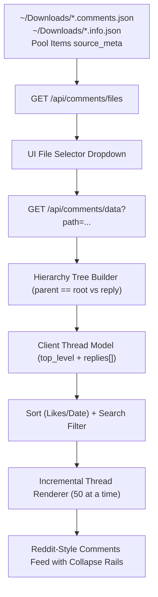

# Reddit-Style Comments Viewer Tab Specification

> **Status:** Draft / Implementation  
> **Target Version:** `000.000.8.112`  
> **Related Specs:** `docs/ytdlp-tab-spec.md` · `docs/video-image-pools-spec.md`

---

## 1. Executive Summary

This specification defines a dedicated **Comments** tab in the **Library** section of ffTransmute WebUI. It provides a clean, Reddit-style nested hierarchical viewer for video comments (e.g., extracted via yt-dlp or companion `.comments.json` / `.info.json` sidecars). It supports:
- 2-level nested Reddit hierarchy (top-level threads with indented replies and vertical collapse rails).
- Sorting by **Top (Most Likes)**, **Newest**, and **Oldest**.
- Per-thread collapse/expand with `[-]` toggles, plus master **Collapse All** and **Expand All** controls.
- Fast real-time text and author search.
- Quick navigation from the yt-dlp Downloader tab and Video Pool cards.
- High-performance incremental rendering for large comment sections (e.g. 8,000+ comments).

---

## 2. Architecture & Data Flow



---

## 3. Backend Endpoints

### 3.1 `GET /api/comments/files`
Scans `~/Downloads` and `state.pool.items` for `.comments.json` and `.info.json` files that contain comments.
- **Returns:**
  ```json
  {
    "ok": true,
    "files": [
      {
        "path": "/home/m/Downloads/AI Just Crossed the Terrifying Line - Now What？ [ujkD4SxPKOI].comments.json",
        "title": "AI Just Crossed the Terrifying Line - Now What？",
        "video_id": "ujkD4SxPKOI",
        "comment_count": 8188,
        "mtime": 1728156000
      }
    ]
  }
  ```

### 3.2 `GET /api/comments/data?path=...`
Loads and groups comments into structured top-level threads and replies.
- Validates that path exists and is a `.json` file.
- Groups comments where `parent == 'root'` (or missing parent) as top-level threads.
- Maps reply comments (`parent == <comment_id>`) into `thread.replies[]`.
- Extracts author, channel, text, like count, time text, timestamp, pinned state, and creator badges.
- **Returns:**
  ```json
  {
    "ok": true,
    "title": "AI Just Crossed the Terrifying Line - Now What？",
    "video_id": "ujkD4SxPKOI",
    "channel": "Kurzgesagt – In a Nutshell",
    "total_count": 8188,
    "threads_count": 5795,
    "threads": [
      {
        "id": "Ugy86UPv5Ol3mR-Ajk94AaABAg",
        "author": "@kurzgesagt",
        "text": "...",
        "like_count": 3500,
        "is_pinned": true,
        "author_is_uploader": true,
        "time_text": "...",
        "timestamp": 1728100000,
        "replies": [
          {
            "id": "Ugy86UPv5Ol3mR-Ajk94AaABAg.Ab_Qn2RRpBkAba8BWKx3Oe",
            "author": "@Lucky9_9",
            "text": "...",
            "like_count": 14,
            "time_text": "...",
            "timestamp": 1728100100
          }
        ]
      }
    ]
  }
  ```

---

## 4. Frontend Design

### 4.1 UI Controls
- **File / Video Selector**: Dropdown listing available videos with comments + Browse button (`#btnCommentsBrowse`).
- **Stats Chip**: e.g., `8,188 comments (5,795 threads)` + title.
- **Search Input**: Instant filter across comment body and author names.
- **Sort Select**:
  - `top` (Most Likes / Upvotes)
  - `newest` (Recent first)
  - `oldest` (Oldest first)
- **Collapse All / Expand All**: Buttons to collapse/expand every visible thread with a single click.

### 4.2 Reddit-Style Thread Component
- **Left Thread Rail**: Vertical border line running down replies that visually links the discussion.
- **Header**:
  - Author handle with `@OP` or `Creator` badge if `author_is_uploader`.
  - Pinned badge (`📌 Pinned`) if `is_pinned`.
  - Relative / exact time.
  - Like count with heart/thumbs up icon (`♥ 3,500`).
  - Collapse button `[-]`.
- **Collapsed State**:
  - When collapsed, the body and replies hide, showing a compact single line:
    `[+] @author · 3,500 likes · 14 replies (click to expand)`
- **Replies Container**: Indented block with its own nested rail for second-level replies.

---

## 5. System Invariants Adherence

1. **Vanilla ES6 / CSS3 (Invariant 7):** Zero frameworks or npm packages.
2. **Failure Contract (Invariant 10):** All API errors return HTTP 200 with `{"ok": false, "error": "..."}`.
3. **Responsive Flow (8.109 / Invariant 2):** Fluid layout with `min-width: 0; max-width: 100%;` and zero horizontal overflow.
4. **Playwright Proof (Invariant 12):** Live browser verification on real comments data.
