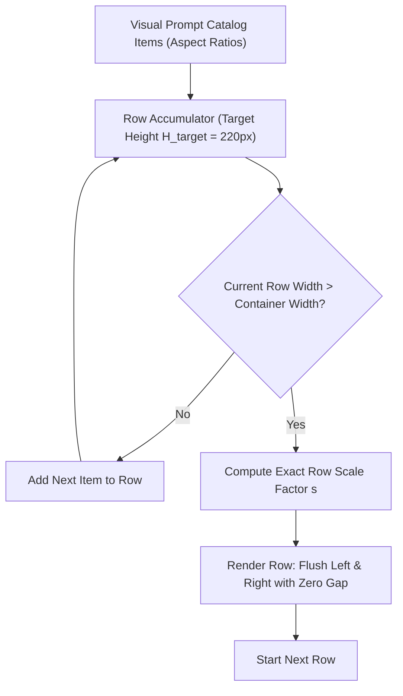

# Visual Prompt Reference Gallery Specification

> **Status:** Draft / Ready for Implementation  
> **Target Version:** `000.000.8.116`  
> **Hat:** Spec Writer (`docs/` only)  
> **Related Specs:** `docs/universal-prompt-module-spec.md` · `docs/prompt-library-spec.md` · `docs/Calendar-Dart-Spec.md` · `docs/performance-catalog-ux-spec.md`

---

## 1. Executive Summary

This specification defines a high-density, smart-tiled **Visual Prompt Reference Gallery** within ffTransmute WebUI (`References` section, sub-tab `refs-visual` / **Visual Prompts**). 

The feature functions as a comprehensive, visual prompt lexicon for image generation and video styling. Each tile represents a distinct visual token—including **Artists** (traditional, modern, digital), **Art Styles & Movements**, **Camera & Lens Types**, **Cinematography & Framing**, **Lighting Scenarios**, and **Mediums/Textiles**.

### Key Architectural Pillars
1. **Smart Tiling (Zero-Gap Justified Rows):** Implements a Yandex/Flickr-style partition algorithm where images preserve their true aspect ratio without cropping, and each row scales horizontally to flush against container bounds with zero empty gaps.
2. **Optimal Asset Pipeline (WebP Dual-Tier):** Utilizes lossy **WebP (Q80–82)** for optimal decode throughput, high compression (~30% smaller than JPEG), and zero-jank 60/120fps scrolling. Decouples low-memory mosaic thumbnails (320–480px width) from master full-res previews to eliminate GPU VRAM crashes.
3. **Toggle A: "Load into Memory" Switch:** Provides an instant mode toggle between:
   - **Stream / Lazy (Default):** Viewport-virtualized loading via `IntersectionObserver` (<80MB RAM footprint).
   - **Pinned / In-Memory:** Preloads all gallery thumbnail assets into browser memory/CacheStorage for zero-latency, lag-free lookbook scrolling across thousands of entries.
4. **Toggle B: "Image Size" Tier Selector:** Dynamic row height scaler (Compact ~140px, Standard ~220px, Large ~320px) with live JS/CSS reflow.
5. **Prompt Token Foundation:** Reserves clean DOM structures for future prompt copy overlays and 1-click handoff to `Txt2Img` and `Img2Img`.

---

## 2. Format & Memory Architecture: WebP Selection & Dual-Tiering

### 2.1 The Format Decision: WebP vs. AVIF vs. JPEG

For massive galleries consisting of 1,000 to 10,000 items, **WebP** is selected as the primary format:

| Characteristic | WebP (Lossy Q80-82) | AVIF | JPEG | Reason for WebP Selection |
|---|---|---|---|---|
| **File Size** | 15–30 KB (at 384px width) | 12–24 KB | 30–55 KB | Excellent network & disk savings. |
| **Decode Latency** | **Fast (SIMD-accelerated)** | **2×–4× slower** | Fast | AVIF causes visible frame drops during high-speed tile scrolling without hardware AV1 decoding. |
| **Browser Support** | **100% universal** | ~93% (older WebKit bugs) | 100% universal | Zero polyfill or fallback requirements. |
| **RAM Footprint (Decoded)** | $W \times H \times 4$ bytes | $W \times H \times 4$ bytes | $W \times H \times 4$ bytes | Decoded bitmap memory is identical across all formats. |
| **Encoding Speed** | Sub-second batch conversion | Slow encoding times | Fast | Instant ingestion of reference image packs. |

### 2.2 Decoded VRAM Guard: The Dual-Tier Pipeline

Browsers decompress all raster images into uncompressed GPU textures upon decoding:
$$\text{Decoded VRAM} = \text{Width} \times \text{Height} \times 4\text{ bytes (RGBA32)}$$

* Loading a $1024 \times 1024$ master directly into a 200px tile consumes **4.19 MB of VRAM per tile**. Rendering 1,000 tiles simultaneously demands **>4.1 GB of GPU RAM**, crashing the browser tab.
* In contrast, serving a **$384\text{px}$ WebP thumbnail** consumes only **$\approx 0.58\text{ MB}$ of VRAM per tile**.

#### The Asset Pipeline Contract:
1. **Tier 1 — Mosaic Thumbnail (`thumbs/`):**
   - Max bounding dimension: 480px (typical rendered width 280–400px).
   - Format: WebP, Lossy Quality 82.
   - Target weight: 15 KB – 32 KB.
2. **Tier 2 — Master Asset (`masters/`):**
   - Original resolution (1024px–2048px).
   - Format: WebP or PNG.
   - Loaded strictly on-demand (e.g. click-to-inspect, zoom modal, or drag-to-input).

---

## 3. Smart Tiling Algorithm (Yandex / Justified Row Layout)

Unlike Masonry layouts (which fix column widths and produce jagged, mismatched bottoms), the **Justified Row Layout** scales each row to the exact width of the container while preserving natural image aspect ratios.



### 3.1 Algorithm Specification (Partition Justified Row)

Given:
- Container usable width: $W_c$
- Target row height: $H_t$ (e.g., 140px, 220px, or 320px)
- Tile gap: $G = 0\text{px}$ (seamless) or $G = 3\text{px}$ (crisp hairline border)
- Items in candidate row $k \in \{1 \dots n\}$, each with native aspect ratio $r_k = \frac{w_k}{h_k}$

1. **Candidate Width at Target Height:**
   $$W_{\text{candidate}} = \sum_{k=1}^n (r_k \times H_t) + (n - 1) \times G$$
2. When $W_{\text{candidate}} \ge W_c$, finalize the row.
3. **Exact Solved Row Height:**
   $$H_{\text{exact}} = \frac{W_c - (n - 1) \times G}{\sum_{k=1}^n r_k}$$
4. **Calculated Width for Item $k$:**
   $$w_k = \text{round}(r_k \times H_{\text{exact}})$$
   *(Note: The last item absorbs any integer rounding difference so $\sum w_k + (n-1)G \equiv W_c$).*

---

## 4. UI Design & Workspace Controls

The gallery is located at `References` $\to$ `Visual Prompts` (`data-tab="refs-visual"`).

```
┌────────────────────────────────────────────────────────────────────────────────────────┐
│ Visual Prompts    [YT Footage] [Video Models] [Image Models] [Visual Prompts] [Music]  │
├────────────────────────────────────────────────────────────────────────────────────────┤
│ [🔍 Filter styles, artists, cameras... ]  [All] [Artists] [Styles] [Camera] [Lighting] │
│                                                                                        │
│ Memory: (o) Stream / Lazy  ( ) Pinned in RAM [Preload All]   Size: [ S ] [ ● M ] [ L ] │
├────────────────────────────────────────────────────────────────────────────────────────┤
│ ┌───────────────┬─────────────────────────────┬──────────────────┬───────────────────┐ │
│ │  Moebius      │   Ukiyo-e (Hokusai)         │  35mm Anamorphic │  Chiaroscuro      │ │
│ │  (Ligne       │   (Woodblock)               │  (Cinematic)     │  (Caravaggio)     │ │
│ │   claire)     │                             │                  │                   │ │
│ ├───────────────┴───────────────┬─────────────┴──────────────────┴───────────────────┤ │
│ │  Syd Mead                     │   Cyberpunk Neon Megacity      │  Macro 100mm f/2.8│ │
│ │  (Futurism)                   │   (Volumetric rain)            │  (Water droplet)  │ │
│ └───────────────────────────────┴────────────────────────────────┴───────────────────┘ │
└────────────────────────────────────────────────────────────────────────────────────────┘
```

### 4.1 Memory Loading Modes

* **Mode 1: `Stream / Lazy` (Default)**
  - DOM contains only virtualized placeholders or images with `loading="lazy"` and `decoding="async"`.
  - An `IntersectionObserver` detaches `src` when tiles scroll $>1.5$ screen heights offscreen.
  - Keeps total page RAM under **80 MB**, even with 5,000+ entries.
* **Mode 2: `Pinned in RAM` (Instant Snappy Mode)**
  - When toggled, an asynchronous background queue loads all thumbnails into the browser's `CacheStorage` or in-memory blob URLs.
  - A subtle progress bar displays caching progress: `[ Cached 450/450 tiles (24MB) ]`.
  - Once pinned, user can fling-scroll the entire catalog with **0ms latency, zero white/grey flash, and instant redraw**.
  - State persisted in `localStorage['mtapi_ref_img_memory_mode']`.

### 4.2 Image Size Tier Selector

* Persisted in `localStorage['mtapi_ref_img_size_tier']`:
  - **`S` (Compact — 140px target height):** High-density overview. Shows ~40–60 references per screen.
  - **`M` (Standard — 220px target height):** Default balanced view showing brush stroke and texture clarity.
  - **`L` (Hero — 340px target height):** Detailed view for analyzing lighting, depth-of-field, and fine geometry.
* Real-time reflow: Changing tiers recalculates the justified row partition in $<5\text{ms}$.

---

## 5. Catalog Schema & Metadata

Visual prompt references are stored in a modular JSON catalog located at `mtapi-project/app/static/data/visual_prompts.json` (or loaded via backend API):

```json
{
  "version": 1,
  "categories": [
    { "id": "artists", "label": "Artists & Illustrators" },
    { "id": "styles", "label": "Art Styles & Movements" },
    { "id": "camera", "label": "Camera, Lens & Framing" },
    { "id": "lighting", "label": "Lighting & Atmosphere" },
    { "id": "mediums", "label": "Mediums & Materials" }
  ],
  "items": [
    {
      "id": "artist_moebius",
      "name": "Jean Giraud (Mœbius)",
      "category": "artists",
      "sub": "Sci-Fi Comic",
      "aspect_ratio": 1.45,
      "thumb": "data/ref-images/thumbs/artists/moebius.webp",
      "master": "data/ref-images/masters/artists/moebius.webp",
      "prompt_token": "in the style of Moebius, ligne claire, clean ink lines, muted pastel color palette, surreal retro-futurism",
      "tags": ["sci-fi", "french comic", "ligne claire", "desert", "airship"]
    },
    {
      "id": "cam_anamorphic_35mm",
      "name": "35mm Anamorphic Lens",
      "category": "camera",
      "sub": "Cinematic Optics",
      "aspect_ratio": 2.39,
      "thumb": "data/ref-images/thumbs/camera/anamorphic_35mm.webp",
      "master": "data/ref-images/masters/camera/anamorphic_35mm.webp",
      "prompt_token": "cinematic 35mm anamorphic lens, oval bokeh, horizontal blue streak flare, shallow depth of field, 2.39:1 widescreen",
      "tags": ["cinematic", "anamorphic", "bokeh", "flare", "widescreen"]
    }
  ]
}
```

---

## 6. Prompt Overlay & Integration (Future Expansion Hook)

Each tile's DOM markup is structured with an accessible overlay container that is unobtrusive by default:

```html
<div class="ref-tile" data-id="artist_moebius" style="width: 319px; height: 220px;">
  
  <div class="ref-tile-scrim"></div>
  <div class="ref-tile-overlay">
    <div class="ref-tile-meta">
      <span class="ref-tile-title">Jean Giraud (Mœbius)</span>
      <span class="ref-tile-sub">Sci-Fi Comic · Ligne claire</span>
    </div>
    <div class="ref-tile-actions">
      <button class="ref-tile-copy" title="Copy Prompt Token">Copy</button>
      <button class="ref-tile-send" title="Send to Txt2Img">→ Prompt</button>
    </div>
  </div>
</div>
```

* **Default State:** Plain image tile with subtle border (smart tiles with no gaps or hairline 2px gap).
* **Hover State:** Scrim softly illuminates; label badge and quick-copy action fade in.
* **Click Action:** Copies `prompt_token` directly to clipboard (respecting LAN non-HTTPS clipboard fallback laws).
* **Send Action:** Injects `prompt_token` into the global `Txt2Img` or `Img2Img` prompt input.

---

## 7. Performance & Invariant Compliance

1. **Invariant 7 (No Frameworks):** Implemented in vanilla ES6 JavaScript and pure CSS3 flex/grid. No external dependencies.
2. **Invariant 10 (HTTP Failures):** Any catalog retrieval route returns HTTP 200 with `{"ok": false, "error": "..."}` on failure.
3. **Invariant 12 (Pre-Flight Gate & Playwright Verification):**
   - Syntax passes `./check-gate.sh` (Node ESM check, index.html balance, Python syntax).
   - Verified via Playwright: toggle between S/M/L image sizes reflows without layout shift or horizontal overflow; switching Memory mode between Stream and Pinned caches cleanly; zero console errors.

---

## 8. Implementation Plan

* **Slice 1 (Core Engine & Layout):**
  - Add sub-tab `refs-visual` in `references.js` / `index.html`.
  - Implement Justified Row Partition algorithm in `mtapi-project/app/static/js/ref-justified-grid.js`.
  - Implement Size Selector (S / M / L) and Memory Toggle (Lazy / Pinned).
* **Slice 2 (Initial Asset Pack & Catalog):**
  - Ingest initial core catalog of ~50–100 curated reference tiles across Artists, Styles, Camera, Lighting, and Mediums.
  - Optimize assets as WebP Q82 thumbnails (384px) and masters.
* **Slice 3 (Search, Filter & Prompt Handoff):**
  - Implement category filter pills (`Artists`, `Styles`, `Camera`, `Lighting`, `Mediums`).
  - Search input with real-time text matching across name, tags, and tokens.
  - Click-to-copy token and `→ Txt2Img` handoff.
