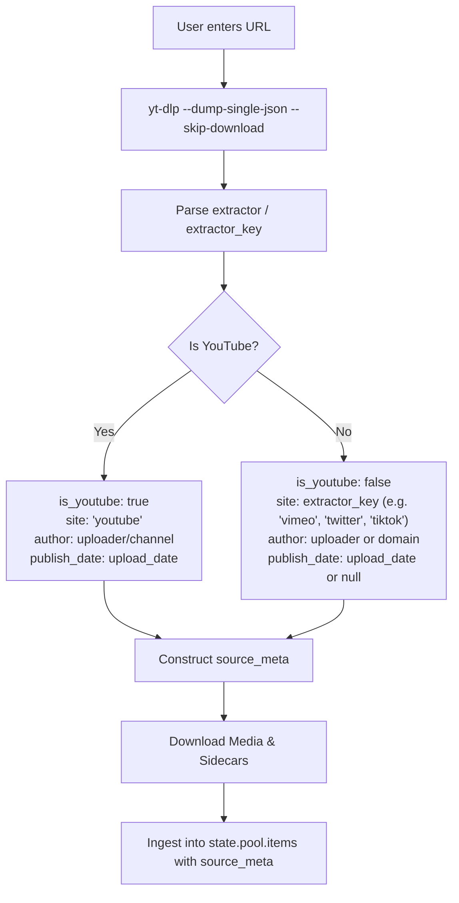

# yt-dlp Media Downloader Tab & Extended Pool Metadata — Spec

> **Status:** Proposed  
> **Date:** 2026-10-04  
> **Audience:** Spec-writer output for Builders (per `AGENTS.md` mission & roles; no app code here)  
> **Classification:** Kind E / Ingest operation (`POST /ops/ytdlp`) + Library Workspace integration  
> **Fits:** ffTransmute WebUI System Invariants #1–12 (`AGENTS.md`)

---

## 1. Problem & Context

Users frequently source video and audio material from YouTube and other web platforms for video processing, datamoshing, RIFE interpolation, and cut sequences. Currently, the user must manually download media outside the application via terminal or browser, find where the file landed, and manually import it via the file picker into the Video Pool.

Furthermore, when clips are imported:
1. Valuable source provenance is lost: Channel / Author, upload / publish dates, platform origin, original URL, tags, view counts, and clip time-ranges are discarded.
2. Auxiliary media assets associated with the video (subtitles, live chat logs, descriptions, and comments) are left behind.
3. The Video Pool cannot filter or sort clips by author, publish date, or platform domain, treating all video files as flat basenames.

This spec defines a dedicated **`yt-dlp` Media Ingest Tab** modeled after the feature set of **Seal** ([junkfood02/Seal](https://github.com/junkfood02/Seal)), augmented with precise **time-range clipping**, **auxiliary asset downloading** (subtitles, live chat, descriptions, comments), **extended metadata retention** in the Dual Pool architecture, and **pool filtering & sorting by author, publish date, and site**.

---

## 2. Goals & Non-Goals

### Goals
- **Full yt-dlp Options Suite (Seal Parity):**
  - Flexible video quality limits (Best, 4K/2160p, 1440p, 1080p, 720p, 480p).
  - Video container preferences (MP4, MKV, WebM, original).
  - Audio extraction with conversion formats (MP3, M4A, OPUS, FLAC, WAV, AAC) and bitrate/quality selection.
  - Multi-threaded fragment downloading (`-N <threads>`), optional `aria2c` external engine, rate limits, proxy support, and cookies (file path or browser extraction).
  - SponsorBlock segment removal or chapter marking.
- **Time-Range Section Clipping:**
  - Start and end time range inputs (HH:MM:SS or seconds) passing `--download-sections "*START-END"` to `yt-dlp` for downloading only the desired clip.
- **Auxiliary Asset Capture (Next-to-Media):**
  - Subtitles: manual and auto-generated, language selection, format conversion (SRT, VTT, ASS), embedding or separate files.
  - Live chat replay: capture `.live_chat.json` for live stream archives.
  - Description: capture `.description` text file.
  - Comments: capture comment tree into the video's `.info.json`.
- **Universal Multi-Site Support & Site Detection:**
  - Full support for 1,700+ websites supported by `yt-dlp` (Vimeo, Twitter/X, TikTok, Reddit, Twitch, Bilibili, generic HTTP, etc.).
  - Automatic detection of site/platform (`site`, `extractor`, `is_youtube`).
  - Graceful degradation when non-YouTube platforms omit specific metadata fields (e.g., live chat or comments).
- **Extended Metadata Attributes (`source_meta`):**
  - Retain metadata on video pool items: `source`, `site`, `is_youtube`, `video_id`, `title`, `author`, `channel`, `channel_id`, `publish_date`, `source_url`, `view_count`, `like_count`, `comment_count`, `tags`, `description_snippet`, `timerange`, `has_subs`, `has_live_chat`, `has_comments`.
  - Whitelist and preserve `source_meta` in `app/media/pool.py` (`_normalize_media_entry`) so project and session saves never drop it.
  - Enrich content-addressable records in `app/media/cache.py`.
- **Video Pool Filtering & Sorting:**
  - Enhance Video Pool search (`poolItemSearchText`) to match author, channel, tags, site, and publish date.
  - Support query filter tokens: `@author`, `author:<name>`, `site:<domain>`, `is:youtube`, `after:<YYYY-MM-DD>`, `before:<YYYY-MM-DD>`, `has:subs`, `has:chat`.
  - Add a **Sort dropdown** to the Video Pool toolbar: Added order (default), Publish Date (Newest/Oldest), Author / Channel (A–Z), Site / Platform (A–Z), Title (A–Z), Duration, File Size.
  - Display site & creator badge chips on Video Pool cards.
- **Post-Download Ingest Controls:**
  - Automatically add to Video Pool (Default: ON).
  - Send to global Media In (`#giMediaIn`) (Default: OFF).
  - Append to Sequence (`sequence[]`) (Default: OFF).

### Non-Goals
- Inventing a custom Python scraping engine; all downloads and probes use the upstream `yt-dlp` executable via `shell.run_command`.
- Bypassing DRM-protected streams.
- Full subtitle translation editor (subtitle files are saved as companion assets for ffmpeg or external tools).
- Modifying Image Pool schema (downloaded videos land in Video Pool `items[]`; if an audio-only file or standalone thumbnail is extracted, it routes according to media mode).

---

## 3. Locked Architectural Decisions

| Decision | Selection | Notes |
|---|---|---|
| **Tab Location** | **Library** section, labeled **`Downloader`** (or `yt-dlp`) | Sits alongside Video Pool, Image Pool, and Sequence because it directly populates the media library. |
| **Backend Transport** | `POST /ops/ytdlp` via `app/operations/ytdlp_ops.py` + `shell.run_command` argv list | **Invariant 2:** NEVER `shell=True`. Arguments passed as safe list; paths and URLs escaped. |
| **Progress Reporting** | Parse `yt-dlp --progress-template` and call `report_progress()` | **Invariant 9:** Reports percentage, download speed, and ETA to the WebUI status strip. |
| **Failure Contract** | HTTP 200 + `{"ok": false, "error": "..."}` | **Invariant 10:** Standard WebUI API failure contract. |
| **Asset Storage Layout** | **Next-to-Media (Sibling)** | Sibling files in the chosen download directory: `<title> [<id>].mp4`, `.info.json`, `.description`, `.live_chat.json`, `.en.srt`. Standard `yt-dlp` pattern. |
| **Metadata Ingest** | `source_meta` dictionary on `state.pool.items[]` | Whitelisted in `app/media/pool.py` `_normalize_media_entry`; persisted in `pool_state.json` and named `.ffproject.json`. |
| **Probe / Preview** | `GET /api/ytdlp/info?url=...` | Fast `yt-dlp --dump-single-json --skip-download` to preview video details and available resolutions before committing. |

---

## 4. Multi-Site Architecture & Edge-Case Handling

While YouTube is the primary platform, `yt-dlp` supports thousands of sites. The system must treat all URLs uniformly while flagging platform specifics:



### Edge Cases for Non-YouTube Sites:
1. **Missing Publish Date**: Some sites (e.g. Twitter/X, direct video links) may return null or unparsed dates. The system stores `null`, and date sorting places clips with unknown dates at the bottom.
2. **Missing Author / Uploader**: If `uploader` and `channel` are missing, fall back to the site domain name (e.g. `vimeo.com`, `reddit.com`) or `"Unknown"`.
3. **Unsupported Chat / Comments**: If the user checks "Download Comments" or "Download Live Chat" on a site that lacks comments or chat API support, `yt-dlp` emits a non-fatal warning; the download must succeed cleanly and set `has_comments: false` / `has_live_chat: false`.
4. **Site-Specific Format Selectors**: Sites with single-stream MP4s ignore DASH video+audio merging; `yt-dlp`'s standard fallback (`bestvideo+bestaudio/best`) handles this automatically.

---

## 5. Metadata Schema & Dual Pool Integration

### 5.1 `source_meta` Schema (Video Pool Item)
Each downloaded item in `state.pool.items[]` carries an optional `source_meta` dictionary:

```json
{
  "path": "/home/m/Videos/Incredible_Clip [dQw4w9WgXcQ].mp4",
  "name": "Incredible_Clip [dQw4w9WgXcQ].mp4",
  "hash": "b2c4...",
  "size": 45120300,
  "meta": {
    "duration": 212.5,
    "fps": 29.97,
    "fps_avg": 29.97,
    "width": 1920,
    "height": 1080,
    "frames": 6368,
    "video_codec": "h264",
    "audio_codec": "aac",
    "has_audio": true,
    "is_vfr_guess": false
  },
  "source_meta": {
    "source": "yt-dlp",
    "site": "youtube",
    "is_youtube": true,
    "video_id": "dQw4w9WgXcQ",
    "title": "Incredible Clip",
    "author": "Artist Name",
    "channel": "Artist Official",
    "channel_id": "UCuAXFkgsw1L7xaCfnd5JJOw",
    "publish_date": "2024-02-14",
    "source_url": "https://www.youtube.com/watch?v=dQw4w9WgXcQ",
    "view_count": 1250000,
    "like_count": 85000,
    "comment_count": 4200,
    "tags": ["music", "synthwave", "remix"],
    "description_snippet": "Official music video for...",
    "timerange": {
      "clipped": true,
      "start": "00:00:30",
      "end": "00:02:15"
    },
    "has_subs": ["en", "ja"],
    "has_live_chat": false,
    "has_comments": true,
    "info_json_path": "/home/m/Videos/Incredible_Clip [dQw4w9WgXcQ].info.json",
    "downloaded_at": 1728079200.0
  }
}
```

### 5.2 Normalization in `app/media/pool.py`
In `app/media/pool.py`, `_normalize_media_entry` must whitelist `source_meta`:

```python
_SOURCE_META_STR_KEYS = (
    "source", "site", "video_id", "title", "author", "channel",
    "channel_id", "publish_date", "source_url", "description_snippet",
    "info_json_path",
)
_SOURCE_META_INT_KEYS = ("view_count", "like_count", "comment_count")
_SOURCE_META_BOOL_KEYS = ("is_youtube", "has_live_chat", "has_comments")

def _normalize_source_meta(raw: Any) -> dict[str, Any] | None:
    if not isinstance(raw, dict):
        return None
    out: dict[str, Any] = {}
    for k in _SOURCE_META_STR_KEYS:
        val = raw.get(k)
        if isinstance(val, str) and val.strip():
            out[k] = val.strip()
    for k in _SOURCE_META_INT_KEYS:
        val = _opt_int(raw.get(k))
        if val is not None:
            out[k] = val
    for k in _SOURCE_META_BOOL_KEYS:
        if k in raw and raw[k] is not None:
            out[k] = bool(raw[k])
    # tags array
    tags = raw.get("tags")
    if isinstance(tags, list):
        out["tags"] = [str(t).strip() for t in tags if str(t).strip()][:50]
    # has_subs array
    subs = raw.get("has_subs")
    if isinstance(subs, list):
        out["has_subs"] = [str(s).strip() for s in subs if str(s).strip()]
    # timerange dict
    tr = raw.get("timerange")
    if isinstance(tr, dict):
        out["timerange"] = {
            "clipped": bool(tr.get("clipped")),
            "start": str(tr.get("start") or ""),
            "end": str(tr.get("end") or ""),
        }
    if raw.get("downloaded_at") is not None:
        out["downloaded_at"] = _opt_float(raw.get("downloaded_at"))
    return out or None
```

---

## 6. Video Pool Filtering & Sorting Engine

### 6.1 Enhanced Search Matching (`poolItemSearchText`)
In `mtapi-project/app/static/js/pool/grid.js`:

```javascript
function poolItemSearchText(item) {
  const m = item.meta || {};
  const sm = item.source_meta || {};
  return [
    item.name,
    item.path,
    item.hash,
    sm.site,
    sm.author,
    sm.channel,
    sm.title,
    sm.publish_date,
    Array.isArray(sm.tags) ? sm.tags.join(' ') : '',
    m.video_codec,
    m.audio_codec,
    m.width && m.height ? `${m.width}x${m.height}` : '',
    m.fps != null ? String(m.fps) : '',
  ].filter(Boolean).join(' ');
}
```

### 6.2 Structured Query Token Support
`filteredPoolItems()` parses query tokens:
- `is:youtube` or `site:<name>`: matches `source_meta.site`.
- `@<author>` or `author:<name>`: matches `source_meta.author` or `source_meta.channel`.
- `after:YYYY-MM-DD` / `before:YYYY-MM-DD`: filters on `source_meta.publish_date`.
- `has:subs`: matches items where `source_meta.has_subs.length > 0`.
- `has:chat`: matches items where `source_meta.has_live_chat === true`.

### 6.3 Video Pool Sorting UI
Add `#poolSort` dropdown to the toolbar in `mtapi-project/app/static/js/pool/grid.js`:

```html
<div class="pool-sort-box">
  <label for="poolSort" class="pool-sort-label">Sort:</label>
  <select id="poolSort" class="select-input select-mini" data-help-title="Sort Video Pool" data-help-text="Sort the video pool cards by publish date, author, site, title, duration, or file size.">
    <option value="default">Added (default)</option>
    <option value="date_desc">Publish Date (Newest first)</option>
    <option value="date_asc">Publish Date (Oldest first)</option>
    <option value="author_asc">Author / Channel (A–Z)</option>
    <option value="site_asc">Site / Platform (A–Z)</option>
    <option value="title_asc">Title (A–Z)</option>
    <option value="duration_desc">Duration (Longest first)</option>
    <option value="duration_asc">Duration (Shortest first)</option>
    <option value="size_desc">File Size (Largest first)</option>
  </select>
</div>
```

The active sort order is stored in `state.pool.sortOrder` and persisted via `persistence.js`. Sorting is executed after filtering in `filteredPoolItems()`.

### 6.4 Pool Card Visual Badges
When an item has `source_meta`, the card displays:
- A platform tag: `[YouTube]` (red accent) or `[Vimeo]`, `[Twitter]`, `[Web]` (neutral accent).
- Author / Channel name and Publish Date formatted as:
  `<span class="pool-badge-meta">Author · 2024-02-14</span>`
- Hovering shows full title, view count, tags, and a link icon to open the original source URL.

---

## 7. `yt-dlp` Tab UI & Controls (Seal Parity)

### 7.1 Tab Layout & Banks (`js/tabs/ytdlp.js`)

```text
┌────────────────────────────────────────────────────────────────────────────────────────┐
│  URL: [ https://www.youtube.com/watch?v=dQw4w9WgXcQ                 ] [ Probe / Info ] │
├────────────────────────────────────────────────────────────────────────────────────────┤
│  [Thumbnail]  Title: Sample Video Title                                                │
│               Channel: Creator Name · Site: YouTube · Upload Date: 2024-02-14 · 03:32  │
│               Stats: 1.2M views · 85K likes · Tags: music, synthwave                   │
├────────────────────────────┬─────────────────────────────┬─────────────────────────────┤
│  Bank 1: Mode & Time Range │  Bank 2: Quality & Codecs   │  Bank 3: Captions & Chat    │
│  • Mode: [ Video | Audio ] │  • Quality: [ 1080p ▾ ]     │  • [x] Download Subtitles   │
│  • Time Range:             │  • Format: [ MP4 ▾ ]        │  • [x] Auto-generated Subs │
│    Start: [ 00:00:30 ]     │  • Audio Fmt: [ MP3 ▾ ]     │  • Languages: [ en.*,all ]  │
│    End:   [ 00:02:15 ]     │  • Bitrate: [ 320k ▾ ]      │  • Sub Format: [ SRT ▾ ]    │
│  • [ ] Entire Video        │  • [x] Multi-audio streams  │  • [x] Embed in Video       │
│  • Playlist: [ Single ▾ ]  │                             │  • [x] Download Live Chat   │
├────────────────────────────┼─────────────────────────────┼─────────────────────────────┤
│  Bank 4: Metadata & Assets │  Bank 5: Network & Engine   │  Bank 6: Destination & Ingest│
│  • [x] Write Description   │  • Fragments: [ 4 ] threads │  • Out Dir: [ /home/m/... ] │
│  • [x] Write Comments      │  • [ ] Use aria2c           │  • Template: [ %(title)s ]  │
│  • [x] Write .info.json    │  • Rate limit: [ None ]     │  • [x] Add to Video Pool    │
│  • [x] Save Thumbnail      │  • Proxy: [               ] │  • [ ] Send to Media In     │
│  • [ ] Embed Thumbnail     │  • Cookies: [ Browser: Chrome]• [ ] Append to Sequence   │
│  • [ ] Crop 1:1 (Audio)    │  • [ ] Force IPv4           │                             │
│  • SponsorBlock: [ Mark ▾] │                             │                             │
└────────────────────────────┴─────────────────────────────┴─────────────────────────────┘
[  Download Media  ] [ Dry Run ]  Status: Ingest complete · Added to Video Pool (32.4 MB)
```

### 7.2 Controls Specification

1. **Top Bar:**
   - URL input (`#ytdlpUrl`) with clipboard paste quick button.
   - `Probe / Info` button (`#ytdlpBtnProbe`): triggers `GET /api/ytdlp/info` and reveals the inspector card.
2. **Bank 1 (Mode & Time Range):**
   - Mode switch: Video vs Audio (`extract_audio`).
   - Time Range: Start and End text inputs (`HH:MM:SS` or `SS`). When populated, flags `--download-sections "*START-END"`.
   - Playlist mode: Single item vs Full playlist vs Items range (`--playlist-items 1-5`).
3. **Bank 2 (Quality & Codecs):**
   - Video Quality select: Best / 2160p (4K) / 1440p / 1080p / 720p / 480p.
   - Video Container select: MP4 (default) / MKV / WebM.
   - Audio Format select: Original / MP3 / M4A / OPUS / FLAC / WAV / AAC.
   - Audio Quality / Bitrate select: Best (0) / 320k / 256k / 192k / 128k.
   - Multi-audio streams toggle (`--audio-multistreams`).
4. **Bank 3 (Captions & Chat):**
   - Download Subtitles toggle (`--write-subs`).
   - Auto-generated Subtitles toggle (`--write-auto-subs`).
   - Subtitle Languages text input (default `en.*,all`).
   - Subtitle Format select: SRT / VTT / ASS (`--convert-subs`).
   - Embed Subtitles toggle (`--embed-subs`).
   - Download Live Chat toggle: `--sub-langs "live_chat"` to fetch `.live_chat.json`.
5. **Bank 4 (Metadata & Assets):**
   - Write Description toggle (`--write-description` → `.description`).
   - Write Comments toggle (`--write-comments` into `.info.json`).
   - Write .info.json toggle (`--write-info-json`).
   - Save Thumbnail toggle (`--write-thumbnail`).
   - Embed Thumbnail toggle (`--embed-thumbnail`).
   - Crop Artwork toggle (`--ppa "ffmpeg: -c:v mjpeg -vf crop=..."`).
   - Embed Metadata toggle (`--embed-metadata`).
   - SponsorBlock mode: None / Mark chapters (`--sponsorblock-mark`) / Remove segments (`--sponsorblock-remove`).
   - SponsorBlock categories: Chips for Sponsor, Intro, Outro, Self-promotion, Preview.
6. **Bank 5 (Network & Engine):**
   - Concurrent fragments knob/number (1–16, default 4, `-N`).
   - Use `aria2c` toggle (`--downloader aria2c`).
   - Rate limit text input (`--limit-rate`).
   - Proxy text input (`--proxy`).
   - Cookies select/input: Browser auto-extract (`--cookies-from-browser chrome|firefox|brave`) or Netscape file (`--cookies <file>`).
   - Force IPv4 toggle (`-4`).
7. **Bank 6 (Destination & Ingest):**
   - Output directory: defaults to user downloads or project folder, with in-app folder picker.
   - Output template: default `%(title).200B [%(id)s].%(ext)s`.
   - Ingest Checkbox: **Add to Video Pool** (`[x]` Default ON).
   - Ingest Checkbox: **Send to Media In** (`[ ]` Default OFF).
   - Ingest Checkbox: **Append to Sequence** (`[ ]` Default OFF).

---

## 8. Backend Operation: `POST /ops/ytdlp`

### 8.1 Parameters Model (`YtdlpParams`)
Implemented in `mtapi-project/app/operations/ytdlp_ops.py` with Pydantic validation:

```python
class YtdlpParams(BaseModel):
    url: str
    output_dir: str
    output_template: str = "%(title).200B [%(id)s].%(ext)s"
    
    # Mode & Format
    extract_audio: bool = False
    video_quality: str = "best"
    video_format: str = "mp4"
    audio_format: str = "mp3"
    audio_quality: str = "0"
    audio_multistreams: bool = False
    
    # Time Range
    time_range_start: str | None = None
    time_range_end: str | None = None
    
    # Captions & Chat
    write_subs: bool = False
    write_auto_subs: bool = False
    sub_langs: str = "en.*,all"
    sub_format: str = "srt"
    embed_subs: bool = False
    write_live_chat: bool = False
    
    # Metadata & Assets
    write_description: bool = False
    write_comments: bool = False
    write_info_json: bool = True
    write_thumbnail: bool = True
    embed_thumbnail: bool = False
    crop_artwork: bool = False
    embed_metadata: bool = True
    
    # SponsorBlock
    sponsorblock_action: Literal["none", "mark", "remove"] = "none"
    sponsorblock_categories: list[str] = ["sponsor", "intro", "outro", "selfpromo"]
    
    # Network & Performance
    concurrent_fragments: int = 4
    use_aria2c: bool = False
    limit_rate: str | None = None
    proxy_url: str | None = None
    cookies_path: str | None = None
    cookies_from_browser: str | None = None
    force_ipv4: bool = False
    
    # Ingest Options
    add_to_pool: bool = True
    send_to_media_in: bool = False
    add_to_sequence: bool = False
    dry_run: bool = False
```

### 8.2 Command Line Builder
Builds safe `argv` list for `shell.run_command`:
```python
argv = ["yt-dlp", params.url, "--no-mtime"]

# Format & Mode
if params.extract_audio:
    argv.extend(["-x", "--audio-format", params.audio_format, "--audio-quality", params.audio_quality])
    if params.crop_artwork:
        argv.extend(["--ppa", "ffmpeg: -c:v mjpeg -vf crop=\"'if(gt(ih,iw),iw,ih)':'if(gt(iw,ih),ih,iw)'\""])
else:
    # Quality limit
    if params.video_quality != "best":
        argv.extend(["-S", f"res:{params.video_quality}"])
    if params.video_format in ("mp4", "mkv", "webm"):
        argv.extend(["--merge-output-format", params.video_format])

# Time Range
if params.time_range_start or params.time_range_end:
    s = params.time_range_start or "0"
    e = params.time_range_end or "inf"
    argv.extend(["--download-sections", f"*{s}-{e}"])

# Captions & Chat
if params.write_subs or params.write_auto_subs or params.write_live_chat:
    if params.write_subs:
        argv.append("--write-subs")
    if params.write_auto_subs:
        argv.append("--write-auto-subs")
    
    langs = [params.sub_langs] if params.sub_langs else []
    if params.write_live_chat:
        langs.append("live_chat")
    if langs:
        argv.extend(["--sub-langs", ",".join(langs)])
    if params.sub_format:
        argv.extend(["--convert-subs", params.sub_format])
    if params.embed_subs and not params.extract_audio:
        argv.append("--embed-subs")

# Metadata & Assets
if params.write_description:
    argv.append("--write-description")
if params.write_comments:
    argv.append("--write-comments")
if params.write_info_json:
    argv.append("--write-info-json")
if params.write_thumbnail:
    argv.append("--write-thumbnail")
if params.embed_thumbnail:
    argv.append("--embed-thumbnail")
if params.embed_metadata:
    argv.append("--embed-metadata")

# SponsorBlock
if params.sponsorblock_action == "mark":
    argv.extend(["--sponsorblock-mark", ",".join(params.sponsorblock_categories)])
elif params.sponsorblock_action == "remove":
    argv.extend(["--sponsorblock-remove", ",".join(params.sponsorblock_categories)])

# Network & Performance
if params.concurrent_fragments > 1:
    argv.extend(["-N", str(params.concurrent_fragments)])
if params.use_aria2c:
    argv.extend(["--downloader", "aria2c"])
if params.limit_rate:
    argv.extend(["--limit-rate", params.limit_rate])
if params.proxy_url:
    argv.extend(["--proxy", params.proxy_url])
if params.cookies_path:
    argv.extend(["--cookies", params.cookies_path])
elif params.cookies_from_browser:
    argv.extend(["--cookies-from-browser", params.cookies_from_browser])
if params.force_ipv4:
    argv.append("-4")

# Output template
out_path = Path(params.output_dir) / params.output_template
argv.extend(["-o", str(out_path)])
```

### 8.3 Post-Execution Harvest & Ingest
1. `yt-dlp` writes the downloaded file and accompanying sidecar files.
2. The handler reads the corresponding `.info.json` emitted by `yt-dlp`.
3. Constructs the validated `source_meta` dictionary:
   - Evaluates `extractor_key` to set `site` and `is_youtube = (site.lower() == "youtube")`.
   - Populates `author`, `publish_date`, `tags`, `view_count`, etc.
   - Detects which sidecar files exist (`.description`, `.live_chat.json`, `.srt`, `.info.json`).
4. Returns an `OperationResult`:
   ```python
   OperationResult(
       ok=True,
       operation="ytdlp",
       output_path=str(media_file),
       command=" ".join(argv),
       detail={
           "source_meta": source_meta,
           "sidecars": {
               "info_json": str(info_json_path),
               "description": str(desc_path) if desc_path.exists() else None,
               "live_chat": str(chat_path) if chat_path.exists() else None,
               "subs": sub_paths,
           },
           "add_to_pool": params.add_to_pool,
           "send_to_media_in": params.send_to_media_in,
           "add_to_sequence": params.add_to_sequence,
       }
   )
   ```
5. Frontend receives the result and automatically ingests the media into `state.pool.items` with its `source_meta` already populated.

---

## 9. File Map & Impact Analysis

| File | Change | Role |
|---|---|---|
| `docs/ytdlp-tab-spec.md` | **NEW** | This specification document. |
| `mtapi-project/app/operations/ytdlp_ops.py` | **NEW** | Backend op `POST /ops/ytdlp`, CLI builder, progress parsing, metadata extraction. |
| `mtapi-project/app/routes/ytdlp.py` | **NEW** | Fast info inspection endpoint `GET /api/ytdlp/info`. |
| `mtapi-project/app/operations/__init__.py` | **MODIFY** | Import `ytdlp_ops` to register with contract `REGISTRY`. |
| `mtapi-project/app/media/pool.py` | **MODIFY** | Add `_normalize_source_meta` whitelist to `_normalize_media_entry` so session/project saves keep source data. |
| `mtapi-project/app/media/cache.py` | **MODIFY** | Store and enrich `source_meta` on cached content-addressable records. |
| `mtapi-project/app/static/js/tabs/ytdlp.js` | **NEW** | Downloader tab form, Seal option banks, probe card, and execution wiring. |
| `mtapi-project/app/static/css/ytdlp.css` | **NEW** | Styles for option banks, probe card, and progress indicators. |
| `mtapi-project/app/static/js/pool/grid.js` | **MODIFY** | Search text expansion (`poolItemSearchText`), sort engine (`#poolSort`), and card badges. |
| `mtapi-project/app/static/js/pool/persistence.js` | **MODIFY** | Persist `state.pool.sortOrder` and pass `source_meta`. |
| `mtapi-project/app/static/app.js` | **MODIFY** | Tab routing, title, and import registration. |
| `mtapi-project/app/static/index.html` | **MODIFY** | Add nav item in Library section and stylesheet link. |
| `mtapi-project/tests/test_ytdlp_ops.py` | **NEW** | Unit tests for CLI builder, time ranges, and metadata normalization. |

---

## 10. Verification Plan

### Automated Tests
1. **Fast Gate Verification:**
   ```bash
   ./check-gate.sh
   ```
   Must pass 5/5 stages cleanly (syntax, JS ESM import scan, HTML balance).
2. **Pytest Suite:**
   ```bash
   cd mtapi-project && .venv/bin/python -m pytest tests/test_ytdlp_ops.py tests/test_pool*.py
   ```
   - Assert CLI builder produces correct arguments for all Seal options.
   - Assert `--download-sections "*00:01:00-00:02:30"` correctly built from start/end inputs.
   - Assert `_normalize_source_meta` whitelists and sanitizes YouTube and non-YouTube metadata.
   - Assert non-YouTube URLs correctly identify `site` and set `is_youtube: false`.

### Manual & UI Verification (Playwright)
1. **Inspect / Probe:**
   - Open WebUI at `:24590`. Navigate to **Library → yt-dlp**.
   - Input a valid YouTube URL and click **Probe / Info**.
   - Verify title, channel name, duration, and thumbnail appear.
2. **Time-Range Download & Ingest:**
   - Set Time Range: `00:00:02` to `00:00:08`.
   - Enable `[x] Subtitles`, `[x] Write Description`, `[x] Add to Video Pool`.
   - Click **Download Media**.
   - Verify progress bar moves with real percentage/speed.
   - Verify downloaded video duration is ~6 seconds.
   - Verify sibling `.description` and `.info.json` files exist on disk.
3. **Video Pool Search & Sorting:**
   - Switch to **Video Pool**.
   - Verify new clip card has `[YouTube · Channel Name · Date]` badge.
   - Search by channel name in `#poolFilter`: card remains visible.
   - Change `#poolSort` dropdown to "Publish Date (Newest first)" and "Author / Channel (A–Z)": verify ordering.
   - Reload page (`F5`): verify clip and its `source_meta` badge persist completely.
