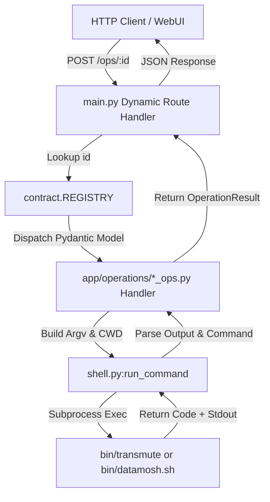

# AGENTS.md — App Package Agent Directives

> **Scope**: Package directory `/home/m/snc/cod/ffTransmuteWebui/mtapi-project/app`
> **Audience**: Autonomous AI Agents modifying core server logic, routing, media indexing, or execution contracts.

---

## 🎯 1. Mission & Responsibilities

The `app` package is the engine room of `mtapi-project`. It decouples web routing from CLI execution logic through `contract.REGISTRY`.

Agents working in `app` are responsible for:
- Maintaining API contract stability.
- Ensuring safe, non-blocking subprocess management.
- Guarding against media cache corruption.
- Serving WebUI assets correctly.

---

## 🏗️ 2. Core Architecture & Inter-Module Flow

---

## 🔒 3. Invariants & Rules

1. **`main.py` Route Autogeneration**:
   - `main.py` MUST NOT hardcode individual tool endpoints (`/ops/square_crop`, `/ops/datamosh_melt`, etc.). Route registration happens dynamically by walking `contract.REGISTRY`.
2. **Side-Effect Population**:
   - Importing `from . import operations` in `main.py` triggers `operations/__init__.py`, which imports all `*_ops.py` files to populate `REGISTRY`. Every new ops module MUST be imported in `app/operations/__init__.py`.
3. **DO NOT Add `from __future__ import annotations` in `main.py`**:
   - Postponed evaluation breaks FastAPI's parameter introspection for `spec.params_model`.
4. **Concurrency Safety in `media_store.py`**:
   - Multi-threaded disk reads/writes to `~/.cache/mtapi/media/` MUST acquire `_index_lock` or specific `_hash_locks[content_hash]` to prevent JSON corruption during concurrent hash updates.

---

## 💡 4. Workflows for Agents

### Adding a New API Feature or System Endpoint
1. If adding a media/workspace feature (e.g. video slicing preview), implement helper methods in `media_store.py` or `shell.py`.
2. Add the corresponding FastAPI endpoint in `main.py`.
3. Test endpoint using curl or FastAPI Swagger UI at `http://localhost:24590/docs`.

### Modifying the Subprocess Shell Interface
- Keep `shell.py:run_command` signature clean: `(argv: list[str], cwd: str | None = None) -> tuple[int, str, str]`.
- Always decode stdout/stderr with `errors="replace"` to prevent UnicodeDecodeError on raw binary output from ffmpeg or ffglitch.
