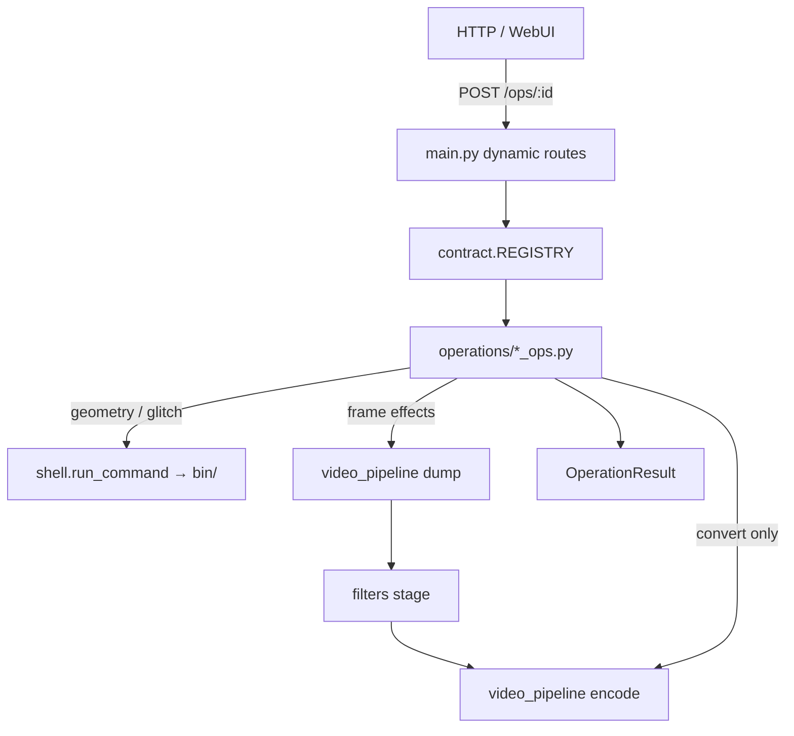

# AGENTS.md — App Package Agent Directives

> **Scope**: `/home/m/snc/cod/ffTransmuteWebui/mtapi-project/app`  
> **Audience**: Agents modifying server logic, routing, media, contracts, pipeline, filters.

---

## 1. Mission

The `app` package is the engine room: **contracts**, **bookends**, **stages**, **ops**, **media**, **WebUI static**.

---

## 2. Architecture

```text
HTTP / WebUI
    │  POST /ops/{id}
    ▼
contract.REGISTRY  ──►  operations/*_ops.py  (thin)
                              │
              ┌───────────────┼───────────────┐
              ▼               ▼               ▼
         CLI shell      video_pipeline    filters/*
         (transmute,    dump / process    per_frame |
          datamosh)     / encode          directory
                              │
                              ▼
                       job_workspace
                       convert_presets
```


```mermaid
graph TD
    A[HTTP / WebUI] -->|POST /ops/:id| B[main.py dynamic routes]
    B --> C[contract.REGISTRY]
    C --> D[operations/*_ops.py]
    D -->|geometry / glitch| E[shell.run_command → bin/]
    D -->|frame effects| F[video_pipeline dump]
    F --> G[filters stage]
    G --> H[video_pipeline encode]
    D -->|convert only| H
    D --> I[OperationResult]
```

| Module | Role |
|--------|------|
| `video_pipeline.py` | **Bookends**: probe, dump, process, encode |
| `convert_presets.py` | Codec / dump target recipes (Convert + encode kwargs) |
| `job_workspace.py` | Isolated job dirs under `/tmp/mtapi_jobs/` |
| `pipeline_chain.py` | Multi-stage run; honors `kind=directory` vs per_frame |
| `filters/` | Stage factories only — **no** dump/encode ownership |
| `operations/` | HTTP params + thin orchestration + legacy engines |
| `media/` | Pool, cache, thumbs, projects |
| `shell.py` | Async subprocess argv lists |

Canonical narrative: repo `docs/filter-platform-spec.md`.

---

## 3. Invariants

1. **`main.py` does not hardcode op routes** — walks `REGISTRY`.  
2. **New ops modules** must be imported in `operations/__init__.py`.  
3. **Never** `from __future__ import annotations` in `main.py`.  
4. **Media index** locks when mutating cache JSON.  
5. **New frame effects** register a stage in `filters/` and a thin op — not a third dump path.  
6. **Pipeline and named op share one factory** for each stage name.  
7. Mid-chain frames: `frame_%06d.png`, start_number **0**.  
8. **Frame range:** Global UI sends 1-based inclusive `start_frame` / `end_frame` (datamosh convention). Ops that dump video must accept those fields and pass them to `video_pipeline.dump(...)`. Full clip = `1` / `999999`.

---

## 4. Workflows

### New filter stage
1. `filters/<name>.py` → `register_stage("name", factory)`.  
2. Set `callable.kind` to `"per_frame"` or `"directory"`.  
3. Thin op uses dump/process/encode or directory runner.  
4. Smoke test + optional pipeline chain step.

### Extend Convert
1. Add preset to `convert_presets.py`.  
2. Wire `convert_ops` target list / UI optgroup in `static/js/tabs/convert.js`.  
3. Do not duplicate argv tables in ops.

### CLI-only op
Use `shell.run_command` + cwd rules for transmute; still `OperationResult`.

---

## 5. Hazards

- Encoding with wrong `start_number` after tools that emit 1-based frames — normalize (see RIFE).  
- Blocking TF/neural work inside async filters: use `asyncio.to_thread`.  
- Expanding frame count without `directory` kind breaks 1:1 process assumptions.
